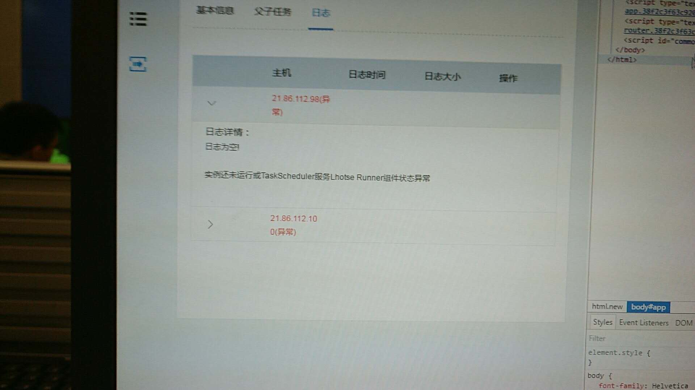
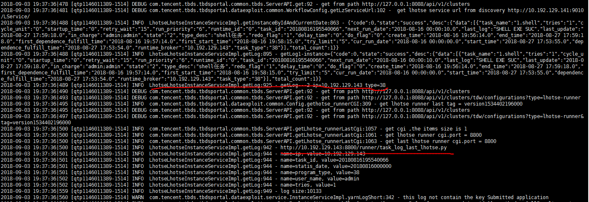
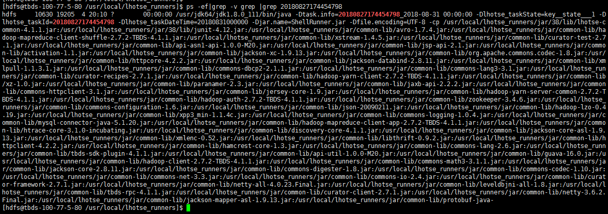
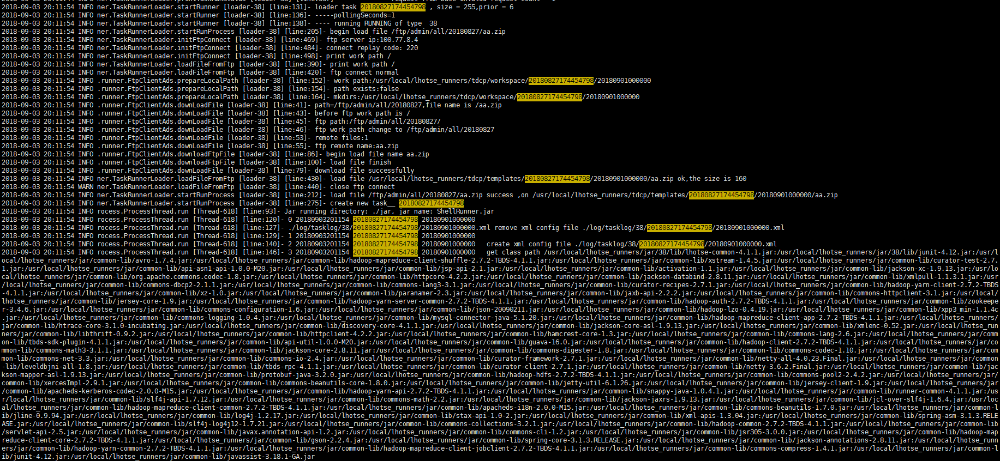

#### 该文档用于协助解决前台portal页面加载实例日志失败的问题

##### 现象


##### 日志列表后台实现逻辑
* 先查询最近运行的五个实例（去数据库查）
* 然后从每个对应的runner节点获取最新的五个日志文件
* 最后综合选取最新的五个日志文件
* 点击对应日志文件，再次访问对应的runner节点的日志文件

##### 问题定位
可能原因
  * 任务还未运行，日志还未产生
  * taskScheduler service 服务异常
  * taskScheduler runner 对应的httpd 服务异常


###### 一、确认service 组件是否运行正常
  * 通过8080或者80端口 系统运维查看service状态是否正常。
  * 切到portal节点，tail -f /usr/local/tbds-portal/log/application.log 。  
再次触发查看实例日志列表，查看关键字 getLog 前后文，确认service 接口返回信息正常。

再次触发查看日志内容，查看关键字getLog 前后文，正常返回接口如下图

  
###### 二、确认runner httpd 服务是否运行正常
通过 curl 命令判断 httpd 服务是否正常。  
注意： 下面命令demo 中http://10.192.129.143:8800  要替换成runner节点ip 和httpd 启动端口（可以从上图日志获取）。
```
curl  -X POST --data "task_id=20170520150634270&ip=101&statis_date=20170529000000&program_type=38"  http://10.192.129.143:8800/runner/task_list_log_lhotse.py 
```
只要连接ok，则表示httpd 服务正常。 
比如下图现实，也表示httpd 服务正常。  

###### 三、确认任务实例是否运行正常
   * 确保实例运行超过一分钟。确保实例已经下发到runner节点。
   * 切到显示主机节点，通过命令确认实例日志真实存在(/usr/local/lhotse_runners/log]# find ./ |grep realtaskId)。
``` 
/usr/local/lhotse_runners/log]# find ./ |grep 20180822160802085
```
如果存在20180712000000.*.log 类型文件，则说明文件真实存在。   
   * 如果文件不存在，但是页面显示任务运行中，则可能是实例假运行。  
    1. 查询runner节点是否有对应runner进程存在。  
ps -ef|grep realTaskId
```
比如
ps -ef|grep 20180822160802085
```
如果实例存在出现如下图内容

    2. 查询runner节点中loader日志文件（/usr/local/lhotse_runners]# vi log/lhotse_task_loader.log），通过realtaskId 关键字查询启动实例是否有失败日志.  
如果实例进程启动成功出现如下图内容。

